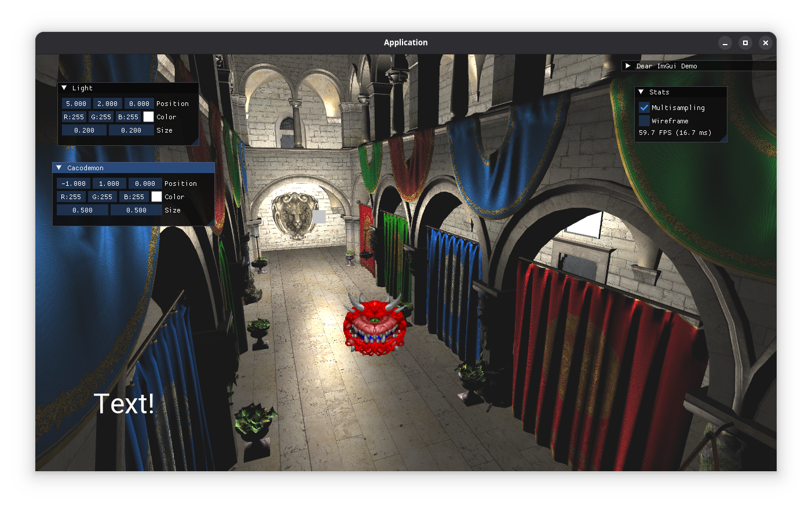

# Empty OpenGL Renderer

* Renderer that i created following [LearnOpenGL](https://learnopengl.com) to learn myself OpenGL.



## Build

Build in debug:

```bash
cmake -D CMAKE_BUILD_TYPE=Debug -B build/
cmake --build build/ -j $(nproc)
```

Build and run in debug:

```bash
./run.sh
```

# Features
* Model loading using Assimp library
* Phong lighting
* Text rendering using Freetype library
